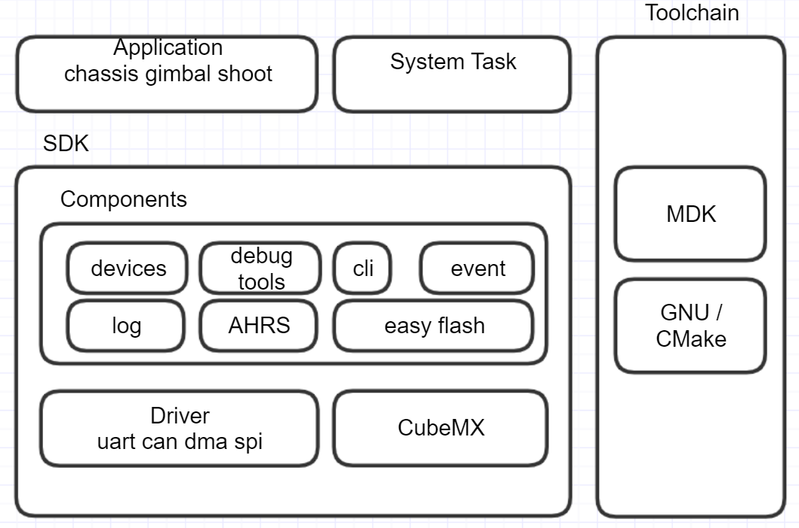

## Summarize

### software environment

 - Toolchain/IDE : MDK-ARM V5 / arm-none-eabi
 - package version: STM32Cube FW_F4 V1.24.0
 - FreeRTOS version: 10.0.0
 - CMSIS-RTOS version: 1.02

### Programming standard

- Naming of variables and functions should follow Unix/Linux style
- chassis\_task and gimbal\_task is hard real-time task, have the highest priority cannot be preempted or blocked by other tasks
- The tasks that do not need accurate timing are realized by self-actualized software timer, and the timing accuracy is affected by task scheduling

### Notice

1.As the shooting system trigger have a low resistance, small rotation of load motor could make the bullet move across the trigger and touch the friction wheel, causes the friction wheel motor unable to launch. **friction wheel will be wore and motor launch fail**. As a result, before you turn on the power, please be sure that no bullet have across the trigger. **How to take the bullet out**：hold friction wheel on one side with your hand, rotate the other friction wheel.

2.As the snail motor fail to initialize, the frequency of the sound generate by the motor is in the response range of angular velocity. it will disturb the control of the gimbal, result in loss of control. **Solution**：could use bandstop filter on gyroscope data. （not include in this version）

3.In gimbal control logic, consider that testing virsual recognize armor may need shoot bullet, we allowed single shoot mode under full-auto mode, but if you forget to return the rod to the middle. it will cause the robot change from full-auto mode to manual mode and start continuous shoot mode. As a result, **after you shoot a bullet under full-auto mode, please return the left rod to the middle**

4.International development board type C have a jumper cap. The firmware check if the signal of pin is low to decide it on the chassis or gimbal. if you cannot control the robot and no-sound-and-light alert, please check if the jumper cap is loose.

### Gimbal calibration method
Underlying code integrated with gimbal and gyro automatic calibration function. You can press the user key to trigger. First, gyro will be calibrated and LED is white. Pitch calculate the mid-value after turns  up until reach the up limit and turns down until reach the down limit.Then Yaw calculate the mid-value after turns left until reach the left limit and turns right until reach the right limit.

Triggering Condition:
1. Development board first time flashed program or parameter area is emptied
2. press the on-board white button to trigger

Notice：when you calibrate, you must put the chassis on a horizontal ground.

### Module Offline Instruction
When a certain module of the vehicle is offline, it can determine which module has a problem according to the different state of the buzzer of the development board. And perform error positioning.

The number of buzzer beeps is indicated according to the priority of the offline module. For example, the priority of the gimbal motor is higher than that of the load motor. If offline occurs at the same time, the current offline device is indicated as the gimbal motor.

The status of the module offline is as follows. The number corresponds to the number of times the buzzer sounds each time, sorted according to priority:

#### Chassis

1. right-front chassis motor offline
2. left-front chassis motor offline
3. left-back chassis motor offline
4. right-back chassis motor offline

#### Gimbal

5. gimbal yaw motor offline
6. gimbal pitch motor offline
7. load motor offline

#### Remote Controller

The red light is always on when The remote control is offline or the referee system or the serial port of the PC is not connected.

#### PC Heart

The blue light is always on when chassis do not receive PC heart packages in auto mode.

### Document

- Protocol  [protocol](../en/protocol.md)

## Quick Start

### Hardware Port

Develop board type c ports:

**gimbal port**
17: pwm pin
18: trigger pin

**chassis port**
19: firmware config pin.

### Functional Module

#### Manual Mode：

support basic control with remote controller

#### Full-auto Mode：

In this mode, Host PC have the full control of chassis, gimbal and shooting system. Full control includes control of these actuators in specific physical units.

#### Control Rod Instruction：

##### Manual

remote control (chassis follows gimbal) : right toggle rod goes up
remote control (gimbal follows chassis) : right toggle rod goes middle

- turn on/off friction wheel (left toggle rod goes up)
- single/continuous shoot (left toggle rod goes down)

##### Auto

Auto mode when competition (right toggle rod goes down)

left toggle rod position and its corresponding function:

- up: turn on friction wheel,
- mid: turn off friction wheel,
- down: single projectile shooting mode only

## System Instruction

### System Architecture

#### Architecture

1. Using free and open-source freertos operating system, consistent with other open-source protocol license
2. Using standard CMSIS-RTOS interface, convenient to transfer to other operating system or platform
3. Provide a set of abstract infantry robot bsp, simplifying upper logic

**Driver**：Directly operate the device driver of the underlying hardware. On the basis of library functions and registers, add lock and asynchronous mechanisms to provide an easier to use api.
**application**：application task. For example: chassis task.

**bsp**: type c board software package

**components**：usualy robot module

**doc**：document

**MDK-ARM**: MDK project

**tools**：cmake gnu toolchain. You should install make, cmake, arm-none-eabi and set env value.

### Software system

SDK uses observe mode to distribute information.

### Hardware system

1. Main control MCU：STM32F427IIHx, Operating frequency: 180MHz
2. Module communication method：CAN；CAN devices：motor speed controller, gyroscope module
3. upper layer and lower layer communication method: USB Virtual serial port
4. McNamm wheel install method：X-type

### Protocal Data

#### Data Classification

Protocol data can be divided into two categories according to the direction of communication：

lower layer send to upper layer:

1. Feedback information: including feedback information of each sensors, and some feedback information calculated by the bottom layer;
2. The underlying state information: including the running state of the underlying device, some response of the underlying layer to the upper layer data, etc.
3. Forward data: contains all the information of the referee system, customized information on the server side；

lower layer receive from upper layer:

1. Control information: upper layer control information on the bottom three actuators

