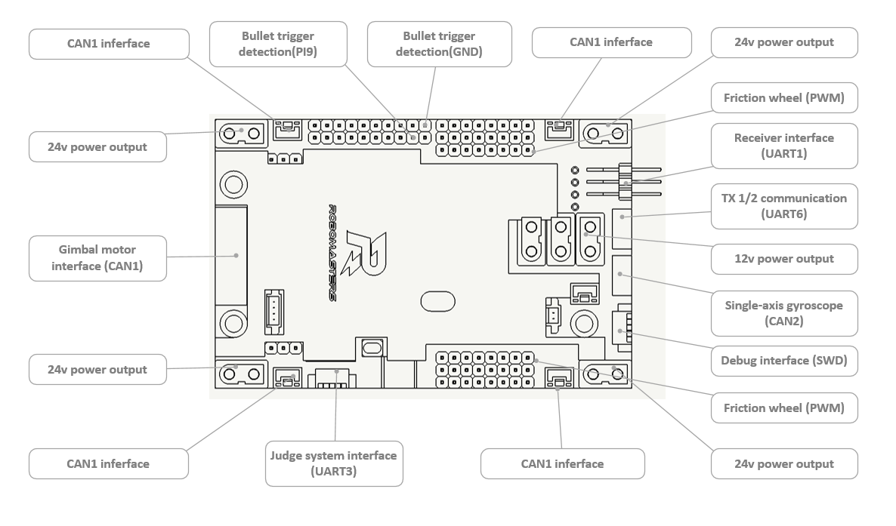

## Summary

RoboRTS infantry control firmware

### Software Environment

- Toolchain/IDE : MDK-ARM V5
- cube version:  STM32CubeMX 4.22.1
- package version: STM32Cube FW_F4 V1.16.0
- FreeRTOS version: 9.0.0
- CMSIS-RTOS version: 1.02

### Programme Specification

- Names of user-defined variables and function should follow Unix/Linux style.
- Due to real time control task executes in Application/AppCtrl, it is prohibited to use any blocking operation.
- When blocking is operated in other tasks, time-out period should be set rationally. Be careful of using mutex or other blocking operation in different priority level and frequency. For example, *detect_task* has lower frequency and *info_get_task*  has higher frequency.

### Attention

- All new document should be written in UTF-8 format in case Chinese characters gibberish generated.
- Document *sys_config.h* includes all configuration parameters of the whole infantry system and user can change those parameters as needed.

### Module Off-line Description

When one of the modules is off-line, user can find out which module is out of work based on indicated light and buzzer in board.

In this project, error warns depend on the priority of off-line modules. 

Corresponding states of each module off-line are shown as following while the number corresponds the number of times of the red light flashes. 

1. Remote controller off-line
2. Gimbal motor off-line
3. Trigger motor or single gyroscope off-line
4. Chassis motor off-line
5. Single gyroscope sensor of chassis off-line
6. Referee system or PC serial port off-line and the red light keeps on

### Documentation

- Communication protocol [document](Doc/protocol/readme.md)
- 中文说明 [文档](Doc/ch/readme.md)

## Quick Start

### Hardware Interface

The following is the location of each interface of the main control board.



### Function Module

#### Manual Mode:

Basic control command including remote control and key-mouse control is executed in manual mode. 

ATTENTION: If the `AUTO_NAVIGATION` macro is defined in the `sys_config.h` file, the Debug Mode and Full-auto Mode will be turned on.

#### Full Auto Mode:

Upper layer PC takes the whole control of chassis, gimbal and shooting module in bottom layer in full auto mode.

#### Operating Instructions:

##### Manual Mode

Remote control: (Right switcher state: UP.)

- open or close friction wheel
- single shot or burst

Key-mouse control: (Right switcher state: UP. Left switcher state: MIDDLE.)

- open (Q) or close (Q + shift) friction wheel
- single shot (Click the left mouse button) or burst (Long press the left mouse button)
- twist to dodge bullets (E)

##### Debug Mode

Debugging robot part (Right switcher state: MIDDLE.)

- twist to dodge bullets (Right switcher state: MIDDLE. Left switcher state: UP)
- Gimbal tracks strikers but chassis doesn't follow gimbal (Right switcher state: MIDDLE. Left switcher state: MIDDLE.)
- Gimbal tracks strikers and chassis follows gimbal (Right switcher state: MIDDLE. Left switcher state: DOWN.)

##### Full-auto Mode

Normal competition part (Right switcher state: Down)

- Full-auto control from upper layer.

## Working state instructions

*comment:*

Bold parts shown following are the different modules working states in full-auto mode. User should notice initial value of each mode when upper layer PC transmit control signal.

### Gimbal

```c
typedef enum
{
  GIMBAL_RELAX         = 0,
  GIMBAL_INIT          = 1,
  GIMBAL_NO_ARTI_INPUT = 2,
  GIMBAL_FOLLOW_ZGYRO  = 3,
  GIMBAL_TRACK_ARMOR   = 4,
  GIMBAL_PATROL_MODE   = 5,
  GIMBAL_SHOOT_BUFF    = 6,
  GIMBAL_POSITION_MODE = 7,
} gimbal_mode_e;
```

| Gimbal Mode              | Function                                 |
| ------------------------ | ---------------------------------------- |
| GIMBAL_RELAX             | Gimbal powers off                        |
| GIMBAL_INIT              | Gimbal is being restored from the power off status |
| GIMBAL_NO_ARTI_INPUT     | No manual control data input mode available |
| GIMBAL_FOLLOW_ZGYRO      | The mode in which the gimbal follows the chassis |
| GIMBAL_TRACK_ARMOR       | Gimbal tracks armor, Use GIMBAL_POSITION_MODE instead |
| **GIMBAL_PATROL_MODE**   | Patrol mode, the gimbal yaws periodically, pitch uncontrolled |
| GIMBAL_SHOOT_BUFF        | Shooting buff mode, icra not use         |
| **GIMBAL_POSITION_MODE** | Gimbal position mode, angle between two axes controlled on an upper layer |

### Chassis

```c
typedef enum
{
  CHASSIS_RELAX          = 0,
  CHASSIS_STOP           = 1,
  MANUAL_SEPARATE_GIMBAL = 2,
  MANUAL_FOLLOW_GIMBAL   = 3,
  DODGE_MODE             = 4,
  AUTO_SEPARATE_GIMBAL   = 5,
  AUTO_FOLLOW_GIMBAL     = 6,
} chassis_mode_e;
```

| Chassis mode             | Function                                 |
| ------------------------ | ---------------------------------------- |
| CHASSIS_RELAX            | Power off chassis                        |
| CHASSIS_STOP             | Stop chassis                             |
| MANUAL_SEPARATE_GIMBAL   | Control chassis and gimbal separately in manual mode |
| MANUAL_FOLLOW_GIMBAL     | Chassis follows gimbal in manual mode    |
| **DODGE_MODE**           | **Chassis dodge bullets mode**           |
| **AUTO_SEPARATE_GIMBAL** | **Control chassis and gimbal separately in full-auto mode** |
| **AUTO_FOLLOW_GIMBAL**   | **Chassis follows gimbal in full-auto mode** |

### Shooting Module

```c
typedef enum
{
  SHOT_DISABLE       = 0,
  REMOTE_CTRL_SHOT   = 1,
  KEYBOARD_CTRL_SHOT = 2,
  SEMIAUTO_CTRL_SHOT = 3,
  AUTO_CTRL_SHOT     = 4,
} shoot_mode_e;
```

| Shooting module mode | Function                               |
| -------------------- | -------------------------------------- |
| SHOT_DISABLE         | Power off shooting module              |
| REMOTE_CTRL_SHOT     | Remote control                         |
| KEYBOARD_CTRL_SHOT   | Key-mouse control                      |
| SEMIAUTO_CTRL_SHOT   | Single shot or burst in semi-auto mode |
| **AUTO_CTRL_SHOT**   | **Full-auto control**                  |


## Program Description

### Program System Architecture

#### System Framework

1. This program uses free  open source called freertos operating system, which is compatible with other open source protocol license.
2. This program uses standard CMSIS-ROTS ports, which is convenient to transplant between different operating system and platform.
3. This program can be executed and modified in different compiling environment, such as TrueSTUDIO, SW4STM32 and makefile.

#### Internal Framework

1. Compared to the traditional infantry program framework, this program has multiple running tasks  which can implement multi-threaded logic as well as blocking tasks.
2. There is complete communication protocol between bottom layer and upper layer, which can receive feedback information from different modules of infantry and transmit control signal to corresponding modules.
3. Each task, such as mode switch, data exchange and module control, is proceeded independently in internal program in order to add or remove task and function easily.
4. Chassis, gimbal, shooting module is coupling based on the internal control task, which is easy to switch mode for different needs.

#### Program Structure

1. The board support package layer (BSP) is based on the HAL library, which mainly offers communication ports and configuration of  can, uart, spi, flash and io. 
2. Data exchange layer is the only place which calls the BSP layer program and exchanges data between applied program and hardware equipment.
3. Communication layer is responsible for receiving and transmitting data and control information. Additionally, this layer is capable of packaging and unpacking data including protocol part.
4. Data receiving layer transforms the direct data from exchange layer or  parsed data from communication layer to feedback and control information.
5. Without changing the software framework, mode switch task can implement different user-defined modes based on existing functional module. 
6. Control task, control of the three structures including the cloud platform, the chassis, and the shooting.

### Software System

#### Start-up Sequence

The following is the start sequence diagram for every task.


### Hardware System

1. Micro Controller Unit (MCU) is STM32F427IIHx and  operating frequency is 180 MHz.
2. Module communication method is CAN communication and the related equipments are electronic speed controller and gyroscope.
3. Universal Asynchronous Receiver/Transmitter (UART) is used to communicated between bottom and upper layer.
4. The method of installing Mecanum Wheels is X type.

#### Hardware Structure


### Protocol Data

#### Data Classification

Data transmitted to upper layer from bottom layer:

1. Feedback information part consists of feedback information coming from each module sensors and calculated data from bottom layer.
2. Bottom layer status information part consists of running state of all bottom layer equipments and response of bottom layer to corresponding upper layer data.
3. Forward data information part consists of all the referee system information and the server user-defined information.

Data received from upper layer to bottom layer:

1. Control information part is used to control the three executed mechanism in the bottom layer which are gimbal, chassis and shooting module respectively.
2. Configuration information part includes main information to set up structural of the robot such as tread, wheelbase and initial gimbal position and running state of upper layer. 
3. Forward data information part consists of the data that forwards to referee system through bottom layer and the user-defined information that should be shown in  server. 

#### Data Flow Diagram


