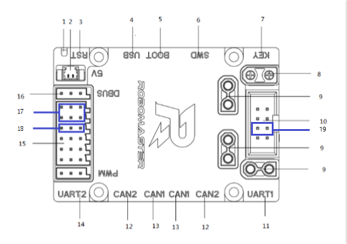

## 概述

- en doc   [readme](doc/en/readme.md)

### 软件环境

 - Toolchain/IDE : MDK-ARM V5 / arm-none-eabi
 - package version: STM32Cube FW_F4 V1.24.0
 - FreeRTOS version: 10.0.0
 - CMSIS-RTOS version: 1.02

### 编程规范

- 变量和函数命名方式遵循 Unix/Linux 风格
- chassis\_task与gimbal\_task是强实时控制任务，优先级最高，禁止被其他任务抢占或者阻塞
- 不需要精确计时的任务，采用自行实现的软件定时器实现，定时精度受任务调度影响

### 注意事项

1.由于发射机构触动开关阻力非常小，轻微转动拨弹电机就可能造成子弹越过触动开关触碰摩擦轮，导致摩擦轮摩擦过大无法启动，**造成摩擦轮磨损和电机启动失败**。因此，开电前务必检查是否有子弹已经越过触动开关。**取出办法**：用手按住一侧摩擦轮，旋转另一个摩擦轮。

2.由于snail电机初始化未成功时，电机产生叫声的频率在角速度响应范围内，会极大的干扰云台控制，导致无法正常控制。**解决方法**：可以对陀螺仪数据采用**带阻滤波**解决。（本版本未加入）

3.在云台控制逻辑中，考虑到调试视觉识别装甲时可能需要发射子弹功能，所以自动模式下开放了单发功能。但如果在单发后没有将左拨杆回中，会导致在从自动模式下切回手动模式立刻触发连发模式。因此，**在自动模式下单发之后务必保证将拨杆拨回中间位置。**

4.国际开发板C型上有一枚跳线帽，用于区分当前为底盘模块还是云台模块，插上跳线帽为底盘模块。出现不能控制且无声光报警请检查跳线帽是否松动，

### 兼容2019年车体结构
打开 appcfg.h 文件的宏 ICRA2019 可以使用2019年车体结构参数，包括轮距轴距，云台轴向等。

### 云台校准方法

国际开发板C型自带用户按键，短按可以进行陀螺仪校准。云台模块完成陀螺仪校准后，还会利用机械限位进行云台角度校准

触发条件：

1.开发板首次刷入程序或者参数区被清空

2.按下板载白色按键触发

注意：校准时务必将底盘放在水平地面，保证车体静止

### 模块离线说明

当车辆的某个模块离线时，可以根据声光指示进行问题定位

蜂鸣器鸣叫次数按照离线模块的优先级进行错误指示，例如云台电机优先级高于拨弹电机，如果同时发生离线，先指示当前离线设备是云台电机

注意：有且仅有在遥控器右上摇杆拨到下方，同时底盘C型板接入到机载电脑并运行相关驱动后，才能屏蔽电机模块离线功能

模块离线对应的状态如下，数字对应蜂鸣器每次鸣叫的次数，按照优先级排序：

#### 底盘模块

1. 右前轮电机掉线
2. 左前轮电机掉线
3. 左后轮电机掉线
4. 右后轮电机掉线

#### 云台模块

5. 云台 YAW 电机掉线
6. 云台 PITCH 电机掉线
7. 拨盘电机掉线

#### 遥控器离线

此时红灯常亮，所有执行器失效

#### 妙算心跳离线

当右上角拨杆开关打下时，若没有收到妙算心跳，此时蓝灯常亮

### 文档

- 协议文档  [protocol](doc/ch/protocol.md)
- protocol [document](doc/en/protocol.md)

## 快速开始

### 硬件接口

主控板使用国际开发板 C 型，各个功能接口的位置如下：

**云台接口**
17: pwm pin
18: trigger pin

**底盘接口**
19: firmware config pin.

### 功能模块

#### 手动模式：

提供遥控器基础控制。

#### 全自动模式：

这种模式下底盘、云台、发射机构受到上层 PC 的完全控制，完全控制包含对这些执行机构以具体物理单位的控制。

#### 操作档位说明：

##### 手动档

遥控器控制（底盘跟随云台）：右拨杆上
遥控器控制（云台跟随地盘）：右拨杆中

- 开、关摩擦轮（左拨杆上拨）
- 单发、连发射击（左拨杆下拨）

##### 自动档

正常比赛时使用（拨杆右下）

左拨杆位置对应功能：

- 上：摩擦轮打开，其他全接管
- 中：摩擦轮关闭，其他全接管
- 下：只具有单发功能

## 程序说明

### 程序体系结构

#### 体系框架

1. 使用免费及开源的 freertos 操作系统，兼容其他开源协议 license；
2. 使用标准 CMSIS-RTOS 接口，方便不同操作系统或平台间程序移植；
3. 提供一套抽象步兵机器人bsp，简化上层逻辑；

**application**：上层应用任务，包括系统任务

**bsp**：C型开发板适配包

**components**：通用机器人模块，包括命令行，驱动模块和系统组件

**doc**：说明文档

**MDK-ARM**：armcc工具链，注意：未购买license最多只能编译20kb大小固件

**tools**: cmake gnu toolchain. You should install make, cmake, arm-none-eabi and set env value.

### 软件体系

固件提供统一的机器人软件栈，所有业务逻辑包含在application中，使用观察者模式分发信息，软件框架如下：

### 硬件体系

1. 主控 MCU：STM32F407IGHx，配置运行频率180MHz
2. 模块通信方式：CAN；CAN设备：电机电调、陀螺仪模块
3. 上下层通信方式：USB虚拟串口
4. 麦轮安装方式：O型

### 协议数据

#### 数据分类

协议数据按照通信方向可以分为两大类：

底层发送给上层的数据：

1. 反馈信息：包含各个机构传感器反馈信息、底层计算出来的一些反馈信息；
2. 底层状态信息：包含底层设备运行状态、底层对上层数据的一些响应等；
3. 转发数据：包含裁判系统的全部信息、服务器端的自定义信息；

底层接收的上层数据：

1. 控制信息：上层对底层 3 个执行机构的控制信息；

